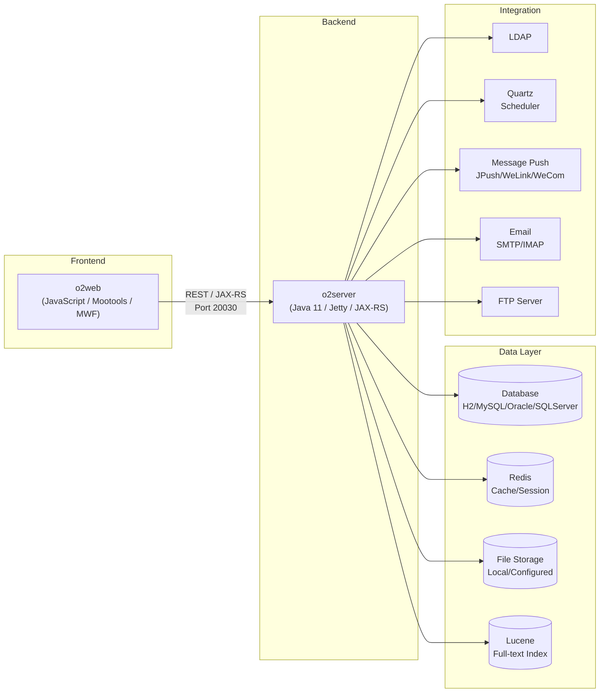

# Architecture Overview

## System Architecture

**Ownership and update triggers:**

- System architecture diagram owned by the technical lead.
- Mandatory update when: new external integration is added, existing integration protocol changes, or major infrastructure migration occurs.

---

## o2server Module Dependency Structure

`o2server` contains 57 Maven modules organized by domain. The diagram below groups modules by functional domain to preserve readability.

```mermaid
graph TD
    subgraph "Base"
        base[x_base_core_project]
    end

    subgraph "Core Entity Modules"
        org_entity[x_organization_core_entity]
        proc_entity[x_processplatform_core_entity]
        file_entity[x_file_core_entity]
        cms_entity[x_cms_core_entity]
        portal_entity[x_portal_core_entity]
        query_entity[x_query_core_entity]
        attendance_entity[x_attendance_core_entity]
        meeting_entity[x_meeting_core_entity]
        message_entity[x_message_core_entity]
        ai_entity[x_ai_core_entity]
        calendar_entity[x_calendar_core_entity]
        bbs_entity[x_bbs_core_entity]
        mind_entity[x_mind_core_entity]
        hotpic_entity[x_hotpic_core_entity]
        component_entity[x_component_core_entity]
        general_entity[x_general_core_entity]
        jpush_entity[x_jpush_core_entity]
        correlation_entity[x_correlation_core_entity]
        program_entity[x_program_center_core_entity]
    end

    subgraph "Core Express Modules"
        org_express[x_organization_core_express]
        proc_express[x_processplatform_core_express]
        query_express[x_query_core_express]
        correlation_express[x_correlation_core_express]
        cms_express[x_cms_core_express]
    end

    subgraph "Assemble Control Modules"
        org_ac[x_organization_assemble_control]
        proc_ac[x_processplatform_assemble_designer]
        portal_ac[x_portal_assemble_designer]
        file_ac[x_file_assemble_control]
        cms_ac[x_cms_assemble_control]
        component_ac[x_component_assemble_control]
        query_ac[x_query_assemble_designer]
        ai_ac[x_ai_assemble_control]
        bbs_ac[x_bbs_assemble_control]
        calendar_ac[x_calendar_assemble_control]
        hotpic_ac[x_hotpic_assemble_control]
        jpush_ac[x_jpush_assemble_control]
        meeting_ac[x_meeting_assemble_control]
        mind_ac[x_mind_assemble_control]
        general_ac[x_general_assemble_control]
        attendance_ac[x_attendance_assemble_control]
    end

    subgraph "Assemble Surface Modules"
        org_as[x_organization_assemble_surface]
        proc_as[x_processplatform_assemble_surface]
        portal_as[x_portal_assemble_surface]
        query_as[x_query_assemble_surface]
    end

    subgraph "Service Processing Modules"
        proc_sp[x_processplatform_service_processing]
        query_sp[x_query_service_processing]
        correlation_sp[x_correlation_service_processing]
        auth_sp[x_organization_assemble_authentication]
        personal_sp[x_organization_assemble_personal]
    end

    subgraph "Program & Console"
        program[x_program_center]
        program_init[x_program_init]
        console[x_console]
    end

    base --> org_entity
    base --> proc_entity
    base --> file_entity
    base --> cms_entity
    base --> portal_entity
    base --> query_entity
    base --> attendance_entity
    base --> meeting_entity
    base --> message_entity
    base --> ai_entity
    base --> calendar_entity
    base --> bbs_entity
    base --> mind_entity
    base --> hotpic_entity
    base --> component_entity
    base --> general_entity
    base --> jpush_entity
    base --> correlation_entity
    base --> program_entity

    org_entity --> org_express
    proc_entity --> proc_express
    query_entity --> query_express
    correlation_entity --> correlation_express
    cms_entity --> cms_express

    org_entity --> org_ac
    proc_entity --> proc_ac
    portal_entity --> portal_ac
    file_entity --> file_ac
    cms_entity --> cms_ac
    component_entity --> component_ac
    query_entity --> query_ac
    ai_entity --> ai_ac
    bbs_entity --> bbs_ac
    calendar_entity --> calendar_ac
    hotpic_entity --> hotpic_ac
    jpush_entity --> jpush_ac
    meeting_entity --> meeting_ac
    mind_entity --> mind_ac
    general_entity --> general_ac
    attendance_entity --> attendance_ac

    org_ac --> org_as
    proc_ac --> proc_as
    portal_ac --> portal_as
    query_ac --> query_as

    proc_entity --> proc_sp
    query_entity --> query_sp
    correlation_entity --> correlation_sp
    org_entity --> auth_sp
    org_entity --> personal_sp

    program_entity --> program
    program --> program_init
    program --> console
```

**Module dependency rules:**

- `x_base_core_project` is the foundation module; all other modules depend on it.
- Entity modules (`x_*_core_entity`) define data models and database mappings.
- Express modules (`x_*_core_express`) provide scripting and expression evaluation on top of entities.
- Assemble control modules (`x_*_assemble_control`) contain business logic and orchestration.
- Assemble surface modules (`x_*_assemble_surface`) provide presentation-layer rendering and integration.
- Service processing modules (`x_*_service_processing`) implement background services and scheduled tasks.
- `x_program_center` and `x_program_init` handle application lifecycle and initialization.
- `x_console` provides the server console and management interface.

**Ownership and update triggers:**

- Module dependency diagram owned collectively by all module leads.
- Mandatory update when: module is added or removed, module dependency changes, or domain restructuring occurs.
