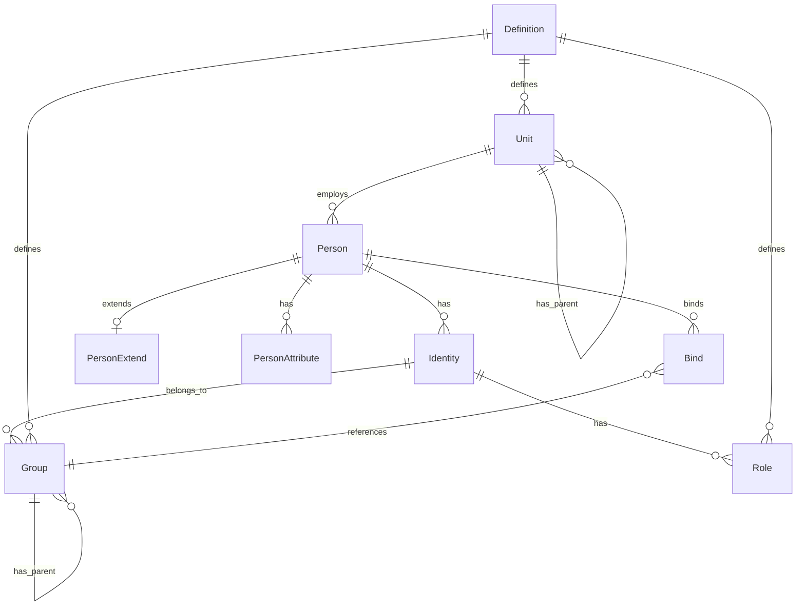
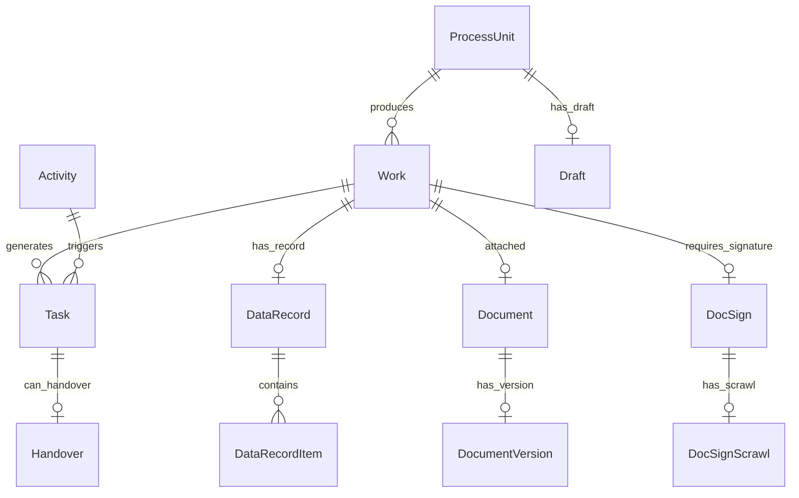
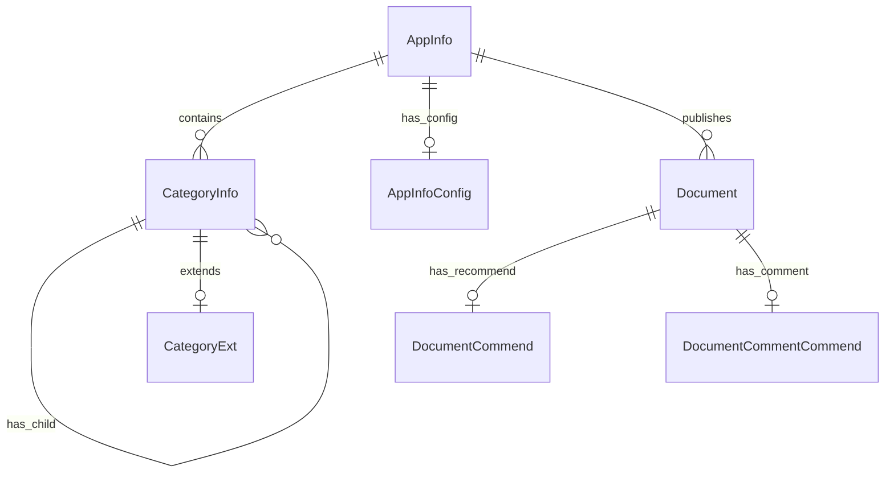
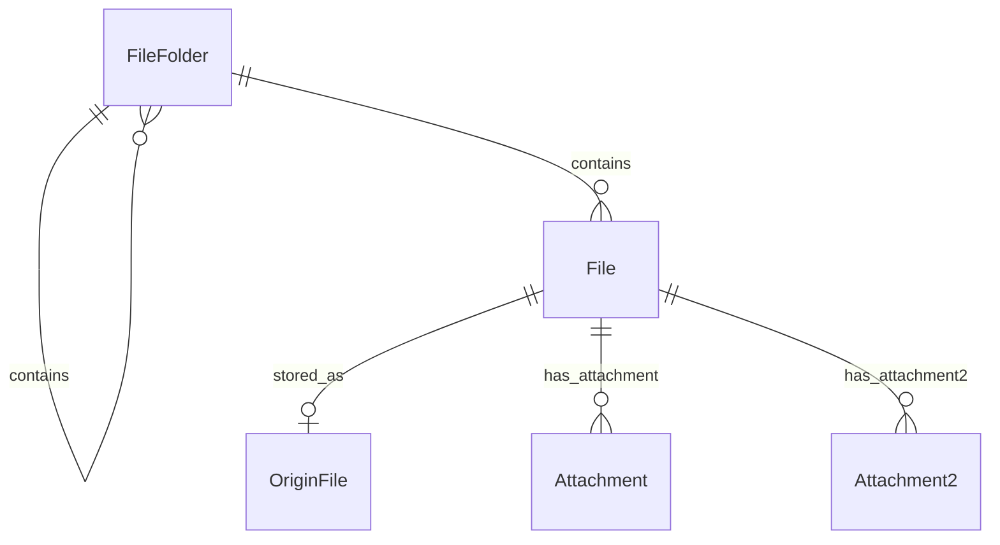
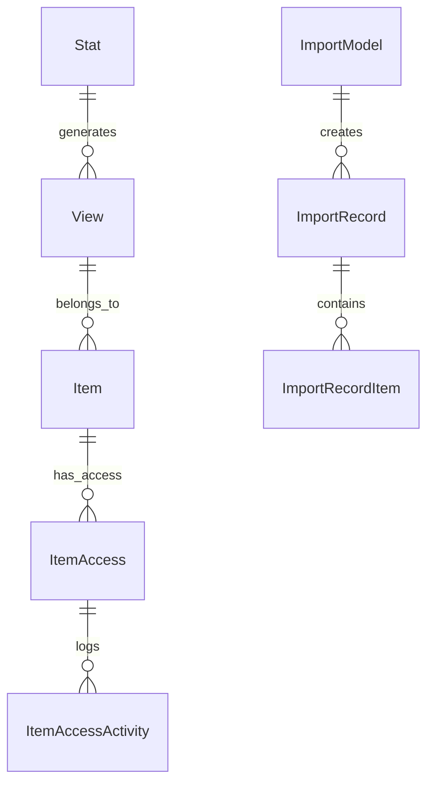
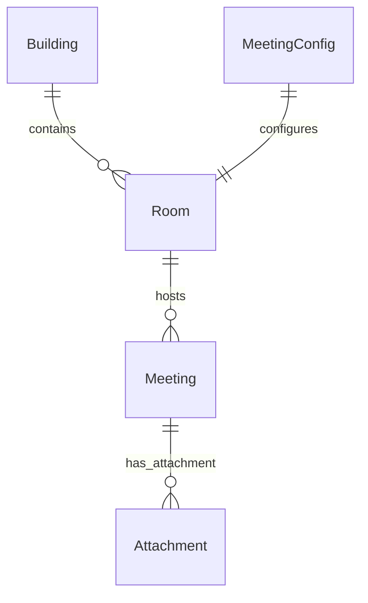
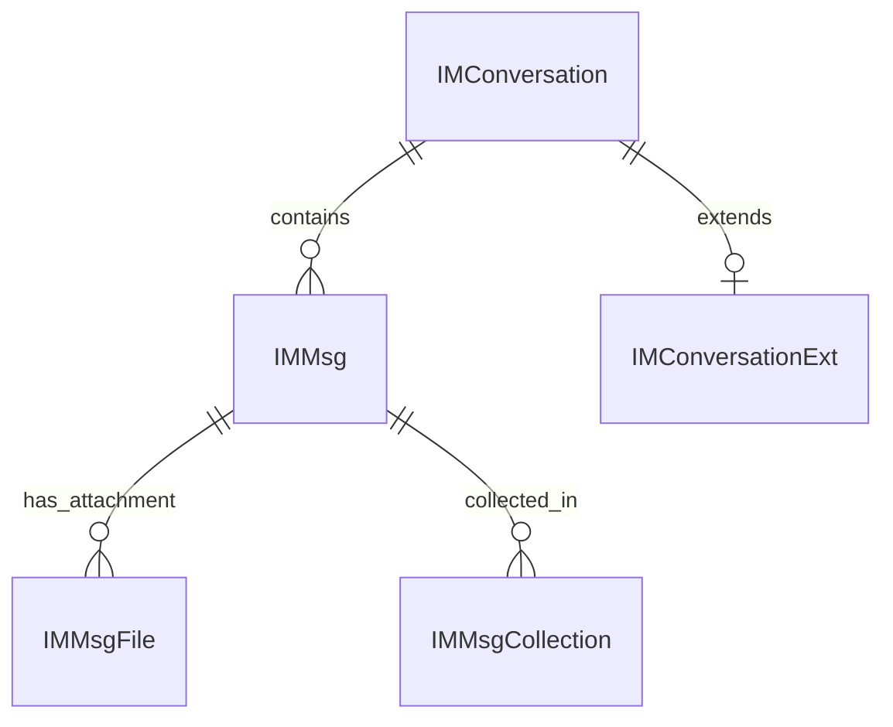
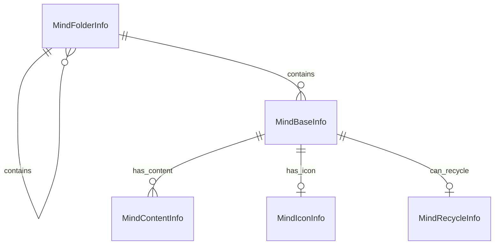
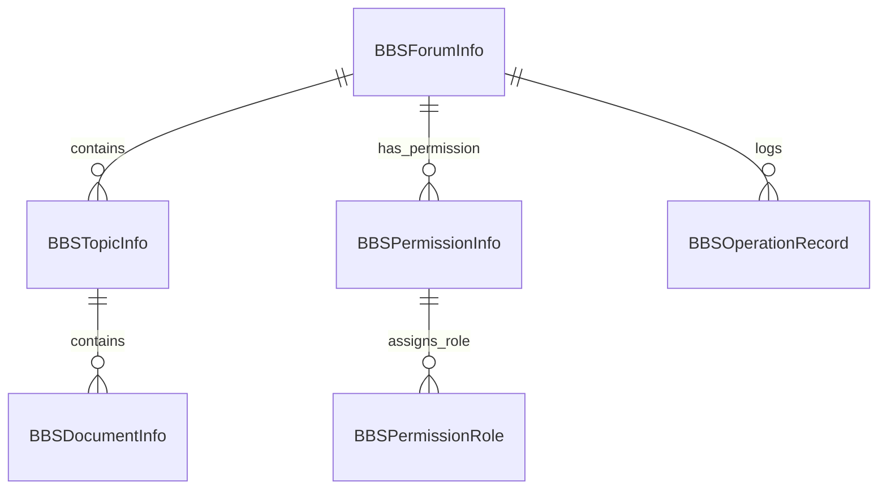
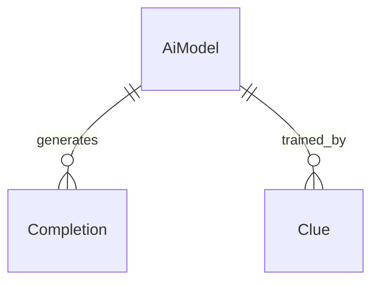

# Data Models

This section describes the core JPA entity classes organized by domain. Entity classes are located in the `x_*_core_entity` modules under `oa/o2server/`.

## Entity Count by Domain

| Domain | Module | Entity Count |
|--------|--------|-------------|
| Organization | x_organization_core_entity | 18 |
| Process Platform | x_processplatform_core_entity | 52 |
| CMS | x_cms_core_entity | 28 |
| Program Center | x_program_center_core_entity | 19 |
| Query | x_query_core_entity | 18 |
| Attendance | x_attendance_core_entity | 40 |
| BBS | x_bbs_core_entity | 18 |
| Message | x_message_core_entity | 8 |
| Mind | x_mind_core_entity | 8 |
| Calendar | x_calendar_core_entity | 6 |
| Meeting | x_meeting_core_entity | 5 |
| General | x_general_core_entity | 5 |
| File | x_file_core_entity | 9 |
| Portal | x_portal_core_entity | 8 |
| AI | x_ai_core_entity | 4 |
| Hotpic | x_hotpic_core_entity | 1 |
| JPush | x_jpush_core_entity | 1 |
| Component | x_component_core_entity | 1 |
| Correlation | x_correlation_core_entity | 1 |
| Base | x_base_core_project | 1 |

## Key Domains

### Organization

Module: `x_organization_core_entity`

Core entities:
- `Definition` — Unit/role definitions
- `Group` — Organizational units
- `Identity` — Person identities
- `Person` — Person profiles
- `Custom` — Custom fields
- `Bind` — Identity-to-group bindings

### Process Platform

Module: `x_processplatform_core_entity`

Core entities:
- `Work` — Work items
- `Activity` — Process activities
- `ProcessUnit` — Process definitions / units
- `Task` — Tasks
- `Document` — Process documents
- `DataRecord` — Form data records
- `Attachment` — Attachments
- `DocSign` — Document signatures

### File

Module: `x_file_core_entity`

Core entities:
- `File` — File metadata
- `OriginFile` — Original file storage
- `Attachment` / `Attachment2` — Attachment wrappers
- `FileConfig` — File configuration

### CMS

Module: `x_cms_core_entity`

Core entities:
- `CategoryInfo` — Content categories
- `AppInfo` — Applications
- `AppInfoConfig` — App configurations
- `Document` — CMS documents
- `CategoryExt` — Category extensions

### Portal

Module: `x_portal_core_entity`

Core entities:
- `Portal` — Portal definitions
- `Page` / `PageVersion` — Portal pages
- `Script` — Portal scripts
- `File` — Portal files

### Query

Module: `x_query_core_entity`

Core entities:
- `Item` — Query items
- `ItemAccess` — Item access control
- `View` — Query views
- `ImportModel` / `ImportRecord` — Import definitions and records

### Attendance

Module: `x_attendance_core_entity`

Core entities:
- `AttendanceDetail` — Attendance records
- `AttendanceAdmin` — Administered scopes
- `AttendanceAppealInfo` / `AttendanceAppealAuditInfo` — Appeals
- `WorkTime` — Work time configurations

### Meeting

Module: `x_meeting_core_entity`

Core entities:
- `Meeting` — Meeting instances
- `Room` / `Building` — Room resources
- `Attachment` — Meeting attachments
- `MeetingConfig` — Meeting settings

### Message / IM

Module: `x_message_core_entity`

Core entities:
- `IMConversation` / `IMConversationExt` — Conversations
- `IMMsg` — Messages
- `IMMsgCollection` — Message collections
- `IMMsgFile` — Message file attachments

### AI

Module: `x_ai_core_entity`

Core entities:
- `AiModel` — AI model definitions
- `Completion` — Completion records
- `Clue` — Clue / training data
- `File` — AI-related files

### Mind

Module: `x_mind_core_entity`

Core entities:
- `MindBaseInfo` — Mind maps
- `MindContentInfo` — Map content
- `MindFolderInfo` — Folder structure
- `MindIconInfo` / `MindRecycleInfo` — Icons and recycle bin

### BBS

Module: `x_bbs_core_entity`

Core entities:
- `BBSForumInfo` — Forums
- `BBSPermissionInfo` / `BBSPermissionRole` — Permissions
- `BBSOperationRecord` — Operation logs
- `BBSTopicInfo` / `BBSDocumentInfo` — Topics and documents

### General

Module: `x_general_core_entity`

Core entities:
- `ApplicationDict` / `ApplicationDictItem` — Dictionaries
- `GeneralFile` — General-purpose files
- `Invoice` — Invoices
- `District` — Geographic districts

## Relationship Patterns

- Most domain entities extend `com.x.base.core.entity.AbstractPersistence` or a similar base class defined in `x_base_core_project`.
- Entities use `@Table` with a schema-qualified table name convention (`{domain}_*`).
- Relationships are expressed via JPA `@OneToMany`, `@ManyToOne`, and `@OneToOne` annotations. Cross-domain references typically go through the `x_*_core_entity` module of the target domain.

## Entity Relationship Diagrams

### Organization Domain

**Key relationships:**
- `Person` → `Identity`：一人一身份，身份是访问控制的基本单元
- `Person` → `PersonExtend`：一对一对个人扩展信息
- `Person` → `Group/Role/Unit`：通过 `Bind` 实现多对多归属关系
- `Unit` 自引用：组织单位层级结构（树形）

### Process Platform Domain

**Key relationships:**
- `ProcessUnit` → `Work`：流程定义产生流程实例
- `Work` → `Task`：流程实例产生待办任务
- `Work` → `DataRecord`：流程实例绑定表单数据
- `Work` → `DocSign`：流程实例可能需要签名

### CMS Domain

**Key relationships:**
- `AppInfo` → `CategoryInfo`：应用包含栏目树
- `CategoryInfo` 自引用：栏目层级结构
- `AppInfo` → `Document`：应用发布文章

### File Domain

**Key relationships:**
- `FileFolder` 自引用：文件夹树形结构
- `FileFolder` → `File`：文件夹包含文件
- `File` → `OriginFile`：文件元数据指向原始存储

### Query Domain

**Key relationships:**
- `Item` → `ItemAccess`：查询项的访问控制
- `View` → `Item`：视图引用查询项
- `ImportModel` → `ImportRecord` → `ImportRecordItem`：导入模型级联记录

### Meeting Domain

**Key relationships:**
- `Building` → `Room`：楼宇包含会议室
- `Room` → `Meeting`：会议室产生会议实例

### Message Domain

**Key relationships:**
- `IMConversation` → `IMMsg`：会话包含消息
- `IMMsg` → `IMMsgFile`：消息可带文件附件

### Mind Domain

**Key relationships:**
- `MindFolderInfo` 自引用：脑图文件夹树形结构
- `MindFolderInfo` → `MindBaseInfo`：文件夹包含脑图

### BBS Domain

**Key relationships:**
- `BBSForumInfo` → `BBSTopicInfo` → `BBSDocumentInfo`：论坛-帖子-回复层级
- `BBSForumInfo` → `BBSPermissionInfo`：论坛权限配置

### AI Domain

**Key relationships:**
- `AiModel` → `Completion`：模型生成对话记录
- `AiModel` → `Clue`：模型训练数据

## Domain Cross-Reference

| 实体 | 被其他域引用 | 跨域关系 |
|------|-------------|---------|
| `Person` | Process, CMS, BBS, Meeting, Message | 流程审批人、文章作者、论坛用户、会议参与人、消息发送者 |
| `Unit` | Process, Query | 流程组织范围、查询数据范围 |
| `File` | CMS, Process, Meeting | 文章附件、流程文档、会议材料 |
| `Group` | 全部域 | 权限分配的基本单元 |
| `Role` | 全部域 | 角色权限的基础 |
