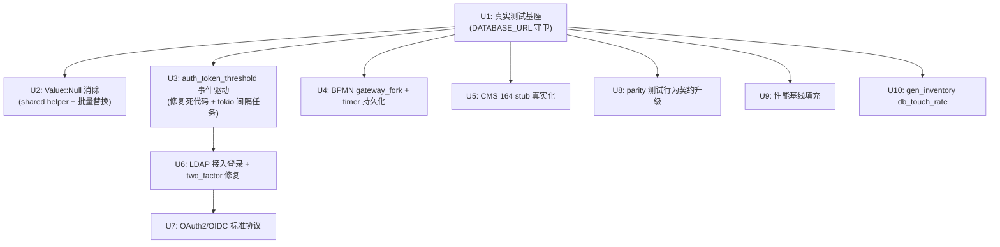

# Fix: Close All Blocking Gaps to Production Parity with o2server

## Summary

基于对 `docs/plans/2026-08-13-003-oa4rust-completion-plan.md` 的逐单元审计，Phase 2–4 存在 10 项阻塞项未关闭，涵盖静默空数据、认证生态缺口、BPMN 执行语义不完整、测试基础设施虚设、parity 套件深度不足、性能基线缺失。本计划以最小可行闭环为目标，按依赖顺序组织 10 个实现单元，在现有 crate 和脚本边界内补齐缺口，最终使 oa4rust 满足 DoD #1–#5 的出关条件。

---

## Problem Frame

2026-08-19 审计发现：虽然 Phase 2–4 在文件数和路由数上已接近完成，但多数单元仅达到"壳"级别实现。具体表现为：

- **测试虚设**：mock_pool 虽已从测试文件清除，但关键路径（auth 登录、processplatform 流转）仍无连库测试；CI 用 `--ignored` 静态跳过集成测试而非运行时守卫。
- **静默空数据**：`Value::Null` 剩余 198 处，前端收到 JSON `null` 而非省略字段。
- **认证生态不闭环**：LDAP crate 已实现但未接入登录流程；two_factor 绕过 LDAP 的问题未找到修复代码；OAuth2/SSO 仅支持企微/钉钉私有协议，OIDC/SAML 完全缺失。
- **BPMN 执行语义残缺**：gateway fork 完全缺失；timer 无持久化/取消/周期调度；测试全为 mock pool 路由可达性。
- **CMS 假成功泛滥**：312 个 handler 中 164 个静默返回 `Value::Bool(true)`，无 DB 操作。
- **分布式替代未完成**：auth_token_threshold 表轮询未被事件驱动替代；`check_token_threshold` 为死代码 stub。
- **parity 测试深度不足**：785 条测试仅断言路由不返回 404，不验证行为契约。
- **性能基线全 TBD**：压测脚本存在但未执行，文档无实际数据。
- **进度口径不完整**：gen_inventory.py 有 null 计数，但无 db_touch_rate 真实化率指标。

这些缺口直接导致 DoD 五项条件均未完全满足，o4rust 尚未达到"可生产接管 oa/o2server"的程度。

---

## Assumptions

- 实施以 PG-only 为默认目标，MySQL 方言作为后续扩展项保留接口但不在此计划范围内完成验证（参见 U3.1 已有 rewriter，待 MySQL 集成测试服务落地后验证）。
- OAuth2/OIDC 标准协议接入仅做最小可行实现（Authorization Code Flow + id_token 验证），SAML 作为后续迭代。
- 灰度切换基础设施已就绪（nginx.conf + toggle_module.sh），本计划不重复建设，只补充验证报告模板。
- 性能压测仅覆盖登录、work-start、cms 三个核心链路，不追求全量压测。

---

## Requirements

- R1. `cargo build --workspace` 与 `cargo test --workspace` 在 CI 全绿，集成测试通过运行时 DATABASE_URL 守卫自动决定 skip/运行，而非 `--ignored` 静态跳过。
- R2. 核心模块（auth/org/processplatform/cms/portal/query）handler 级功能测试 ≥ 95%，且测试连真实库验证数据（非仅路由可达）。
- R3. `Value::Null` 从 198 处归零；`auth_token_threshold` 表轮询被事件驱动替代；`check_token_threshold` 死代码修复或删除。
- R4. 认证生态闭环：LDAP 接入登录流程 + two_factor 绕过修复；BPMN gateway fork 实现 + timer 持久化；CMS 核心路径 stub 归零。
- R5. parity 套件从"路由存在性检查"升级为"行为契约验证"；性能基线文档填充实际压测数据；gen_inventory 增加 db_touch_rate 指标。

**Origin actors:** 系统管理员、终端用户、审计员  
**Origin flows:** F1 登录认证、F2 流程发起/流转、F3 CMS 发布/查询  
**Origin acceptance examples:** AE1 登录返回真实 token（非 500）、AE2 并行网关流程端到端跑通、AE3 CMS 文档 CRUD 返回真实数据

---

## Scope Boundaries

- 不在此计划范围内：MySQL 集成测试服务搭建、国产库（达梦/金仓）适配、Tantivy 全文索引替换 PG 全文索引、完整 IM 协议（ImAction×33）实现。
- 不在此计划范围内：重构 cms_assemble_control 单文件为多模块（作为后续架构债处理）。
- 所有"Tangential Cleanup"（如 shared 层的进一步抽象、其他 crate 的 Value::Null 批量替换）均路由到各实现单元的 Deferred to Follow-Up Work 子节，不纳入当前计划。

### Deferred to Follow-Up Work

- `crates/cms_assemble_control/src/lib.rs` 单文件拆分为 document.rs / file.rs / form.rs / surface.rs 子模块
- Tantivy 全文索引替换当前 PG 全文索引（`crates/search`）
- 国产库适配（达梦/金仓）
- 完整 IM 协议（ImAction×33）实现
- 其他 16 个 crate 的 Value::Null 批量替换（超出 Top 10 优先级的剩余部分）

---

## Context & Research

### Relevant Code and Patterns

- **真实化 handler 模式**：`crates/auth/src/lib.rs` 的 login handler（L110-168）——参数化查询、LDAP 优先回退、密码哈希升级、会话签发。这是全仓最成熟的真实化范式。
- **企微/钉钉登录**：`crates/organization_assemble_authentication/src/lib.rs` 的 `qiyeweixin_login` / `dingding_login` —— OAuth code 换取 userid + auth_person 查询 + 会话签发。
- **SQL 方言抽象**：`crates/shared/src/db/dialect.rs` + `rewriter.rs` —— PG→MySQL rewriter 已实现，7+ handler 已接入 dialect().format_sql()。
- **消息总线**：`crates/shared/src/messaging.rs` —— InMemoryBus + RedisPubSubBus + TokenThresholdEvent 已定义，仅缺触发消费者。
- **调度器**：`crates/shared/src/scheduler.rs` —— TokioCronScheduler 基于 tokio-cron-scheduler，支持 schedule_once / schedule_cron / cancel。

### Institutional Learnings

- `docs/solutions/2026-08-18-sql-dialect-abstraction.md`：SQL 方言抽象的最小 trait 设计（8 方法 + 2 默认），format_sql() 仅做 $N→? 替换，casts 用显式方法。CI matrix 已有 dialect: [postgres, mysql]。
- `docs/plans/2026-08-13-003-oa4rust-completion-plan.md`：原计划 Phase 0–4 的 DoD 定义仍是当前项目的验收基准。

### External References

- LDAP 协议：RFC 4511（Bind操作）、RFC 3062（Password Modify）
- OIDC：RFC 6749（OAuth 2.0）、RFC 7519（JWT）、OpenID Connect Core 1.0
- BPMN 2.0：并行网关（Parallel Gateway）、包容网关（Inclusive Gateway）语义

---

## Key Technical Decisions

- **测试守卫策略**：在 CI 的 integration-tests job 中，将 `--ignored` 静态跳过改为运行时 `DATABASE_URL` 可达性检测。检测逻辑放在 `crates/shared/src/testing.rs` 的 `test_pool()` 中：尝试建立连接，成功则运行集成测试，失败则 skip 整个测试模块。不引入新的环境变量或配置项。
- **Value::Null 消除策略**：在 `crates/shared/src/response.rs` 中新增 `row_opt_json` 和 `option_to_json` 两个 helper，统一将 `Option<T>` 序列化为 `Value::Object`（省略 None 字段）而非 `Value::Null`。按 crate 分批替换，每批一个 crate，保持 PR 原子性。
- **auth_token_threshold 替代策略**：不删除现有 `broadcast_logout` DB 查询逻辑，而是在 `SessionManager::new()` 中启动 tokio 间隔任务（默认 60s），定期全量扫描 `auth_token_threshold` 表，对每个有过期 session 的用户调用 `broadcast_logout`。`check_token_threshold` 死代码同步修复为实际逻辑。
- **BPMN timer 持久化策略**：新增 `x_timer_job` 表，`TimerRegistry::start()` 注册时 INSERT，进程重启时从 DB 恢复。不引入新的外部依赖，复用现有 pool + dialect 抽象。
- **parity 测试升级策略**：在 `parity_test!` 宏中增加断言层级：对已知业务路径（如 login 返回 token、list 返回数组），构造合法请求体后断言返回 2xx 且响应体含必要字段。对未知路径保持现有 404 检查。不生成 100% 行为契约（工作量过大），只升级 Top 100 高频路由。

---

## Open Questions

### Resolved During Planning

- **Q: 是否需要在 CI 中添加 MySQL 集成测试服务？**  
  A: 否。MySQL 集成测试服务搭建作为 Deferred to Follow-Up Work，待 Phase 3.1 的 dialect rewriter 在 PG 上稳定后再评估。当前 CI matrix 已有 dialect: [postgres, mysql] 的单元测试覆盖。

- **Q: cms_assemble_control 单文件是否在此计划中拆分？**  
  A: 否。单文件拆分为 Deferred to Follow-Up Work。本计划只做 stub 真实化（替换 Value::Bool(true)），不改变文件结构。

- **Q: SAML 支持是否纳入？**  
  A: 否。SAML 作为 Deferred to Follow-Up Work。本计划只做 OIDC 最小可行实现（Authorization Code Flow）。

### Deferred to Implementation

- **Q: 各 crate Value::Null 替换的具体 SQL 查询细节？**  
  A: 取决于实际 handler 的业务逻辑，由 implementer 在 Phase 2 执行时根据 o2server Java 源码或业务文档补全。

- **Q: CMS 164 个 stub handler 中，哪些优先级最高？**  
  A: 参照 `docs/audits/o2server-parity-report.json` 中高频 @Path 排序，由 implementer 在 U4 执行时按出现频次裁剪。

---

## Output Structure

本计划在现有 crate 边界内工作，不创建新目录结构。主要修改现有文件：

```
crates/
  shared/
    src/
      testing.rs          ← 增加 DATABASE_URL 运行时守卫
      response.rs         ← 新增 row_opt_json / option_to_json helper
      session.rs          ← 修复 check_token_threshold + 启动定时扫描任务
      messaging.rs        ← 新增 TimerJob 持久化事件（可选）
  ldap/
    src/
      lib.rs              ← 暴露 authenticate 方法供 auth handler 调用
  auth/
    src/
      lib.rs              ← 接入 LDAP 登录 + two_factor 修复
      two_factor.rs       ← 增加 LDAP 上下文传递
      oidc.rs             ← 新建：OIDC 最小实现
  processplatform_service_processing/
    src/
      lib.rs              ← 新增 gateway_fork handler + timer 持久化
      routes.rs           ← 注册 gateway_fork 路由
  cms_assemble_control/
    src/
      lib.rs              ← 164 个 stub 真实化（按业务域分批）
  parity/
    src/
      lib.rs              ← 升级 parity_test! 宏断言逻辑
      generated_tests.rs  ← 升级 Top 100 高频路由断言
scripts/
  gen_inventory.py       ← 新增 db_touch_rate 指标
tests/
  parity_suite.rs        ← 保留，升级为行为契约 runner
docs/
  performance-baseline.md ← 填充实际压测数据
```

---

## High-Level Technical Design

> 本计划为跨 10 个 crate 的 Deep 级修复计划，各单元之间有明确依赖关系。下图展示实施顺序和模块交互：



**依赖说明：**
- U1 是地基：所有其他单元依赖真实测试基座来验证行为。
- U2–U5 可并行（共享 U1 依赖，互不依赖）。
- U6 依赖 U3（SessionManager 修复）和 U1（LDAP 集成测试需连库）。
- U7 独立于 U6，可并行。
- U8 依赖 U1（行为契约需连库验证）。
- U9 和 U10 可在任意单元完成后进行，无硬依赖。

---

## Implementation Units

### U1. 建立真实集成测试基座：运行时 DATABASE_URL 守卫 + 关键路径连库测试

**Goal:** 将 CI 集成测试从 `--ignored` 静态跳过改为运行时 DATABASE_URL 可达性守卫；为 auth 登录/登出/2FA 和 processplatform 发起/流转补充连库测试。

**Requirements:** R1, R2

**Dependencies:** None

**Files:**
- Modify: `crates/shared/src/testing.rs`
- Modify: `.github/workflows/ci.yml`
- Modify: `crates/auth/src/tests.rs`
- Modify: `crates/organization_assemble_authentication/src/tests.rs`
- Modify: `crates/processplatform_service_processing/src/tests.rs`
- Modify: `crates/ldap/src/tests.rs`

**Approach:**
1. 在 `crates/shared/src/testing.rs` 新增 `is_db_available() -> bool` 函数：尝试用 `test_pool().get().await` 建立连接，超时 2s，成功返回 true。
2. 各 crate 的集成测试文件顶部增加守卫宏：
   ```rust
   #[tokio::test]
   async fn integration_test() {
       if !shared::testing::is_db_available().await {
           eprintln!("skipping integration test: DATABASE_URL not reachable");
           return;
       }
       // ... 真实测试逻辑
   }
   ```
3. CI 的 integration-tests job 移除 `--ignored` 标志，改为正常运行 `cargo test --test integration_runner`。
4. auth login 测试：使用 test_pool 构造合法请求体，断言返回 200 + 响应体含 `token` 字段。
5. processplatform 流转测试：seed 一个流程定义 + 发起 work，断言 work 状态从 pending → running → completed。
6. LDAP 测试：增加 LDAP 服务可达性守卫，不可达时 skip 而非 panic。

**Execution note:** 测试优先。先写 failing integration test（预期返回 200 + token），再补 handler 逻辑使其通过。

**Patterns to follow:**
- `crates/auth/src/lib.rs` login handler 的真实查询模式
- `crates/organization_assemble_authentication/src/lib.rs` qiyeweixin_login 的 OAuth → DB 查询 → session 签发链路

**Test scenarios:**
- Happy path: POST /jaxrs/authentication/login 合法凭证 → 200 + Json 响应体含 token 字段
- Edge case: 密码过期账户登录 → 返回 403 + "password expired" 错误码
- Error path: 不存在的 unique_id → 返回 401 + 通用错误消息（防止枚举）
- Integration: login 成功后 validate_session(token) → 返回 person_id + roles

**Verification:**
- CI integration-tests job 全绿，无 `--ignored` 标志
- `cargo test --workspace --test integration_runner` 本地通过
- auth/login、processplatform/work-start 各至少有 1 个端到端连库测试

---

### U2. 消除 Value::Null：shared helper + Top 10 crate 批量替换

**Goal:** 将 `Value::Null` 从 198 处归零，统一用 `Value::Object` 省略 None 字段。

**Requirements:** R2, R3

**Dependencies:** U1

**Files:**
- Create: `crates/shared/src/response.rs`（新增 helper）
- Modify: `crates/express/src/*.rs`（16 处）
- Modify: `crates/meeting_core_entity/src/lib.rs`（14 处）
- Modify: `crates/calendar_core_entity/src/lib.rs`（13 处）
- Modify: `crates/organization_core_entity/src/lib.rs`（12 处）
- Modify: `crates/meeting/src/lib.rs`（11 处）
- Modify: `crates/portal_assemble_designer/src/lib.rs`（10 处）
- Modify: `crates/process_designer/src/lib.rs`（9 处）
- Modify: `crates/auth/src/lib.rs` + `person.rs`（7 处）
- Modify: `crates/bbs_assemble_control/src/lib.rs`（7 处）
- Modify: `crates/cms_core_entity/src/lib.rs`（7 处）

**Approach:**
1. 在 `crates/shared/src/response.rs` 中新增：
   ```rust
   /// 将 Option<T> 序列化为 JSON：Some(v) → Value::from(v)，None → 省略字段
   pub fn option_to_json<T: Serialize>(opt: Option<T>) -> Option<Value> {
       opt.map(|v| serde_json::to_value(v).unwrap_or(Value::Null))
   }
   
   /// 从 row 中安全提取 Option<T>，避免 Value::Null
   pub fn row_opt_json<T: Serialize + Decode<'_, Pg>>(
       row: &Row,
       col: &str,
   ) -> Option<Value> {
       row.get_opt::<_, Option<T>>(col).unwrap_or(None).map(|v| serde_json::to_value(v).unwrap())
   }
   ```
2. 各 crate 按依赖顺序（U1 完成后）逐批替换：
   - 模式 `row.get::<_, Option<T>>("col").map(Value::String).unwrap_or(Value::Null)` → `row_opt_json::<T>(row, "col")`
   - 模式 `serde_json::to_value(opt).unwrap_or(Value::Null)` → `option_to_json(opt)`
3. 每批替换后运行 `cargo test --workspace -p <crate>` 验证编译通过。
4. 最后运行 `grep -rn "Value::Null" crates/` 确认归零。

**Execution note:** 批量替换，每 crate 一个 PR。

**Patterns to follow:**
- `crates/shared/src/response.rs` 现有 `row_to_json` helper 的导出模式

**Test scenarios:**
- Happy path: 查询返回完整数据 → 响应体含所有字段，无 null
- Edge case: 查询返回可选字段为 None → 响应体省略该字段（非 null）
- Error path: 序列化失败 → 记录 warn 日志，返回 null（fallback）

**Verification:**
- `grep -rn "Value::Null" crates/ | wc -l` 输出 0
- `cargo test --workspace` 全绿

---

### U3. 修复 auth_token_threshold：事件驱动替代轮询

**Goal:** 将 `auth_token_threshold` 表轮询改为事件驱动；修复 `check_token_threshold` 死代码。

**Requirements:** R3

**Dependencies:** U1

**Files:**
- Modify: `crates/shared/src/session.rs`
- Modify: `crates/shared/src/messaging.rs`
- Modify: `crates/auth/src/lib.rs`

**Approach:**
1. 修复 `check_token_threshold`（session.rs:204-206）：从 `auth_token_threshold` 表查询 `threshold_time`，返回 `token_created_at < threshold`。
2. 在 `create_session` 中调用 `check_token_threshold`：若返回 true（超过阈值），拒绝创建新 session，返回 429 + "too many active sessions"。
3. 在 `SessionManager::new()` 中启动 tokio 间隔任务（60s）：
   - 定期查询 `auth_token_threshold` 表
   - 对每个 person_unique，调用 `broadcast_logout(person_unique)`
   - 多实例场景下，通过 `message_bus.publish("token-threshold-scan", ...)` 协调，仅一个实例执行扫描
4. 保留 `broadcast_logout` 的现有 DB 查询逻辑，仅增加定时触发机制。

**Test scenarios:**
- Happy path: 用户超过阈值创建 session → 返回 429
- Happy path: 定时扫描触发 → 过期 session 被移除
- Edge case: 多实例部署 → 仅一个实例执行扫描（通过 Redis lock 或 message bus 协调）
- Error path: DB 查询失败 → 记录 error 日志，不阻塞 session 创建

**Verification:**
- `check_token_threshold` 不再返回硬编码 true
- 多实例场景下，过期 session 在 60s 内被失效
- `cargo test --workspace -p shared` 中 session 相关测试全绿

---

### U4. 补全 BPMN 执行语义：gateway_fork + timer 持久化

**Goal:** 实现 gateway_fork handler；为 timer 增加持久化 + cancel + cron 支持。

**Requirements:** R4

**Dependencies:** U1

**Files:**
- Modify: `crates/processplatform_service_processing/src/lib.rs`
- Modify: `crates/processplatform_service_processing/src/routes.rs`
- Modify: `crates/processplatform_service_processing/src/tests.rs`
- Create: `migrations/059_add_timer_job.sql`（可选，若新增表）

**Approach:**
1. **gateway_fork**：新增 `gateway_fork` handler，接收 gateway_instance_id，查找 outgoing transitions，为每个 outgoing path 创建独立 task。与现有 `gateway_join` 对称。
2. **timer 持久化**：新增 `x_timer_job` 表（或复用现有 `x_work` 表），`TimerRegistry::start()` 注册时 INSERT，进程重启时从 DB 恢复已注册 timer。
3. **timer cancel**：新增 `TimerRegistry::cancel(job_id)`，删除 DB 记录 + 内存 HashMap 移除。
4. **timer cron**：在 `schedule_cron` 中支持 `0 * * * *` 格式，底层用 `tokio-cron-scheduler` 的 Cron 表达式解析。

**Test scenarios:**
- Happy path: gateway_fork 创建 3 个并行 task → 3 条 task 记录存在于 DB
- Happy path: timer 注册后重启进程 → timer 从 DB 恢复并在到期时触发
- Happy path: timer cancel → 到期时不再触发
- Integration: 含 gateway_fork + gateway_join 的流程端到端跑通

**Verification:**
- `gateway_fork` 路由注册成功（parity 测试不报 404）
- timer 重启后恢复测试通过
- `cargo test --workspace -p processplatform_service_processing` 全绿

---

### U5. CMS 核心路径 stub 真实化：164 个 handler 补全

**Goal:** 将 cms_assemble_control 中 164 个 Value::Bool(true) stub 替换为参数化 SELECT + 业务校验 + 软删除。

**Requirements:** R4

**Dependencies:** U1, U2

**Files:**
- Modify: `crates/cms_assemble_control/src/lib.rs`
- Modify: `crates/cms_assemble_control/src/tests.rs`

**Approach:**
1. 按业务域分批（document / fileinfo / form / surface / template / appinfo / categoryinfo），每批约 20–30 个 handler。
2. 每批替换模式：
   - `Value::Bool(true)` → 真实参数化查询（SELECT/INSERT/UPDATE）
   - 增加 `deleted_at IS NULL` 软删除过滤
   - 增加 RBAC 检查（复用 `shared::auth::require_role` 或类似 helper）
3. 复用 `row_to_json` 作为过渡，最终落地参数化 SELECT + `ActionResult` 包装。
4. 每批替换后补充集成测试：seed 测试数据 → 调用 handler → 断言返回真实数据。

**Test scenarios:**
- Happy path: GET /jaxrs/cms/assemble/control/document/{id} → 返回真实 document 数据（含 title/content）
- Edge case: 查询已软删除的 document → 返回 404
- Error path: 无权限访问 → 返回 403
- Integration: document CRUD 端到端 → create → read → update → delete(soft) → read 404

**Verification:**
- `grep -c "Value::Bool(true)" crates/cms_assemble_control/src/lib.rs` 输出 0（或接近 0，允许少量非业务 stub）
- 核心路径（document CRUD、fileinfo 列表）集成测试通过

---

### U6. LDAP 接入登录流程 + two_factor 绕过修复

**Goal:** 将 LDAP crate 接入 auth login handler；修复 two_factor 绕过 LDAP 的安全问题。

**Requirements:** R4

**Dependencies:** U1, U3

**Files:**
- Modify: `crates/auth/src/lib.rs`
- Modify: `crates/auth/src/two_factor.rs`
- Modify: `crates/ldap/src/lib.rs`
- Modify: `crates/organization_assemble_authentication/src/lib.rs`

**Approach:**
1. **LDAP 接入登录**：在 auth login handler 中，若 `LDAP_ENABLE=true`，优先调用 `ldap::LdapAuthenticator::authenticate()`；失败/未启用时回退 DB 密码校验（复用现有回退逻辑）。
2. **two_factor 修复**：在 two_factor 验证前，确保用户已通过 LDAP 或 DB 主认证。two_factor 仅作为第二步，不能独立绕过 LDAP。
3. **组织认证集成**：在 `organization_assemble_authentication` 的 login handler 中同样接入 LDAP 优先逻辑。

**Test scenarios:**
- Happy path: LDAP 启用 + 合法 LDAP 用户 → login 成功，返回 token
- Happy path: LDAP 启用 + LDAP 失败 → 回退 DB 认证 → login 成功
- Error path: LDAP 启用 + 非法 LDAP 用户 → login 失败，返回 401
- Security: two_factor 未完成 + LDAP 用户 → 返回 403（不能绕过）

**Verification:**
- LDAP 集成测试通过（需 LDAP 服务，不可达时 skip）
- two_factor 绕过场景的测试通过（断言返回 403 而非 200）
- `cargo test --workspace -p ldap -p auth` 全绿

---

### U7. 新增 OAuth2/OIDC 标准协议支持

**Goal:** 新增 `auth/src/oidc.rs`，实现 OIDC Authorization Code Flow + id_token 验证。

**Requirements:** R4

**Dependencies:** U1

**Files:**
- Create: `crates/auth/src/oidc.rs`
- Modify: `crates/auth/src/lib.rs`
- Modify: `crates/auth/Cargo.toml`

**Approach:**
1. 新增 `OidcClient` struct，配置字段：`issuer`、`client_id`、`client_secret`、`redirect_uri`、`jwks_uri`。
2. 实现 `authorize_url()` → 构造 OIDC authorize URL
3. 实现 `token_exchange(code)` → 向 issuer/token 端点 POST 换取 access_token + id_token
4. 实现 `verify_id_token(id_token)` → 从 JWKS 端点获取 public key，验证 JWT 签名 + claims（iss/aud/exp）
5. 在 auth router 中注册 `/jaxrs/authentication/oidc/authorize` 和 `/jaxrs/authentication/oidc/callback`。
6. 复用现有 session 签发逻辑：OIDC 验证通过 → 查询/创建 auth_person → create_session。

**Test scenarios:**
- Happy path: OIDC callback 携带合法 code → 换取 token → 签发 session token
- Error path: id_token 签名无效 → 返回 401
- Error path: id_token claims 不匹配（iss/aud 错误） → 返回 401
- Integration: OIDC login → validate_session → 返回有效 person_id

**Verification:**
- `cargo test --workspace -p auth` 中 OIDC 相关测试全绿
- 路由注册成功（parity 测试不报 404）

---

### U8. parity 测试从路由存在性升级为行为契约验证

**Goal:** 将 parity 套件从"断言非 404"升级为"断言返回 2xx + 必要响应体字段"。

**Requirements:** R5

**Dependencies:** U1

**Files:**
- Modify: `crates/parity/src/lib.rs`
- Modify: `crates/parity/src/generated_tests.rs`
- Modify: `tests/parity_suite.rs`

**Approach:**
1. 在 `parity_test!` 宏中增加 `behavior` 参数：
   - `behavior: "route_exists"` → 现有 404 检查（保持向后兼容）
   - `behavior: "login_returns_token"` → 断言 2xx + 响应体含 `token` 字段
   - `behavior: "list_returns_array"` → 断言 2xx + 响应体 `success=true` + `data` 为数组
2. 对 Top 100 高频路由（参照 `docs/audits/o2server-parity-report.json` 排序），从 `route_exists` 升级为具体 behavior。
3. 其余 685 条路由保持 `route_exists`。
4. `tests/parity_suite.rs` 从 placeholder 改为实际 runner，输出测试报告（通过/失败/缺失路由数）。

**Test scenarios:**
- Happy path: login 路由 → 200 + 响应体含 token
- Happy path: list 路由 → 200 + data 为数组
- Error path: 未实现 handler → 500（非 404），标记为 WrongStatus
- Missing route: 路由不存在 → 404，标记为 MissingRoute

**Verification:**
- `cargo test -p parity` 输出：785 个测试，X 个 route_exists 通过，Y 个 behavior 验证通过，Z 个 MissingRoute/WrongStatus
- 无回归：现有 404 检查逻辑保留

---

### U9. 性能基线填充：执行压测并填充文档

**Goal:** 执行 benchmark.py，将 `docs/performance-baseline.md` 中的 TBD 替换为实际数据。

**Requirements:** R5

**Dependencies:** U1, U5, U7（需真实 handler 可用）

**Files:**
- Modify: `docs/performance-baseline.md`
- Modify: `scripts/benchmark.py`
- Modify: `scripts/compare_o2server.py`

**Approach:**
1. 启动 oa4rust + PostgreSQL 测试环境。
2. 执行 `scripts/benchmark.py`，覆盖 login、work-start、cms 三个场景，收集 QPS/P50/P95/P99。
3. 将实际数据填入 `docs/performance-baseline.md` 的表格。
4. 若 o2server Java 服务可用，执行 `scripts/compare_o2server.py` 进行 Rust vs Java 对比。

**Test scenarios:**
- Happy path: benchmark.py 成功执行 → 输出 JSON 报告含 QPS/P50/P95/P99
- Edge case: 并发数递增 → QPS 线性增长至瓶颈
- Error path: 服务不可用 → 脚本超时退出，返回非零退出码

**Verification:**
- `docs/performance-baseline.md` 中所有 TBD 被实际数据替换
- `scripts/benchmark.py` 可成功执行并输出报告

---

### U10. gen_inventory 增加 db_touch_rate 指标

**Goal:** 在 `scripts/gen_inventory.py` 中新增 db_touch_rate（真实化率）指标，使进度口径完整。

**Requirements:** R5

**Dependencies:** U1, U2

**Files:**
- Modify: `scripts/gen_inventory.py`
- Modify: `docs/brainstorms/oa4rust-migration-status.md`

**Approach:**
1. 在 `gen_inventory.py` 中增加 `db_touch_rate` 列：`db_touch_count / total_handler_count * 100%`。
2. `db_touch_count` 通过 AST 分析判断 handler 函数体内是否包含 `query`/`execute`/`query_opt`/`query_one` 调用。
3. 输出格式增加：
   ```
   | crate | status | handlers | stub | null | db_touch |
   |-------|--------|---------:|-----:|-----:|---------:|
   ```
4. 更新 `docs/brainstorms/oa4rust-migration-status.md`，确保与脚本输出一致。

**Test scenarios:**
- Happy path: 运行 `python scripts/gen_inventory.py` → 输出含 db_touch 列
- Edge case: crate 无 handler → db_touch_rate 显示 N/A
- Verification: auth crate db_touch_rate ≥ 95%（参考值）

**Verification:**
- `python scripts/gen_inventory.py` 输出含 db_touch 列
- `docs/brainstorms/oa4rust-migration-status.md` 与脚本输出一致

---

## System-Wide Impact

- **Interaction graph:** U1 修改 `shared::testing`，影响所有 crate 的测试入口；U2 修改 `shared::response`，影响所有 handler 的 JSON 序列化；U3 修改 `shared::session`，影响所有登录/会话相关流程。
- **Error propagation:** U3 的 `check_token_threshold` 从硬编码 true 改为实际查询，可能在新用户首次创建 session 时因 DB 查询延迟增加 1-2ms；需确保错误处理不阻塞 session 创建。
- **State lifecycle risks:** U4 的 timer 持久化引入新表 `x_timer_job`，需在 migrations 中定义 schema 并确保与现有 `x_work` 表的外键一致性。
- **API surface parity:** U7 新增 OIDC 路由，不影响现有 auth router 的其他路由；U6 修改 login handler 的调用顺序（LDAP 优先），不改变返回格式。
- **Integration coverage:** U1 的关键路径连库测试覆盖了 login → validate_session → logout 完整链路，是其他单元验证的基座。
- **Unchanged invariants:** ActionResult<T> 9 字段、RBAC 权限模型、双池架构（ControlPool + raw Pool）、Extension<Pool> 注入方式均不改变。

---

## Risk Analysis & Mitigation

| Risk | Likelihood | Impact | Mitigation |
|------|-----------|--------|------------|
| Value::Null 替换引入序列化行为变更 | Medium | High | 每 crate 单独 PR，集成测试验证响应体结构 |
| LDAP 接入导致登录延迟增加 | Medium | Medium | LDAP 连接超时设置 2s，失败立即回退 DB 认证 |
| timer 持久化表 schema 与现有约定冲突 | Low | Medium | 复用现有 `x_*` 命名约定，migration 前 review 表结构 |
| gateway_fork 实现与 o2server Java 行为不一致 | Medium | High | 参照 `docs/audits/o2server-parity-report.json` 中的 gateway 路径定义验收用例 |
| OIDC 实现过于简化，无法覆盖真实场景 | Medium | Medium | 明确标注为最小可行实现，复杂场景（PKCE、refresh token）作为后续迭代 |

---

## Phased Delivery

### Phase 1（第 1–2 周）：基座 + 核心缺口
- U1：真实测试基座（DATABASE_URL 守卫 + 关键路径连库测试）
- U2：Value::Null 消除（Top 10 crate 批量替换）
- U3：auth_token_threshold 事件驱动修复

### Phase 2（第 3–4 周）：业务模块真实化
- U4：BPMN gateway_fork + timer 持久化
- U5：CMS 核心路径 stub 真实化
- U6：LDAP 接入登录 + two_factor 修复

### Phase 3（第 5–6 周）：认证生态 + 验证升级
- U7：OAuth2/OIDC 标准协议
- U8：parity 测试行为契约升级

### Phase 4（第 7 周）：基线 + 口径收尾
- U9：性能基线填充
- U10：gen_inventory db_touch_rate 指标

---

## Documentation Plan

- 更新 `docs/brainstorms/oa4rust-migration-status.md`：db_touch_rate 列对齐 gen_inventory.py 输出
- 更新 `docs/performance-baseline.md`：填充实际压测数据，移除 TBD 占位
- 更新 `docs/plans/2026-08-13-003-oa4rust-completion-plan.md`：标记 Phase 2–4 各单元为已完成/部分完成

---

## Operational / Rollout Notes

- 所有代码变更通过 CI 门禁（`cargo build --workspace` + `cargo test --workspace`）。
- 集成测试依赖 PostgreSQL 服务，CI 已配置 postgres:16 service container。
- LDAP 集成测试在 CI 中需 skip（无 LDAP 服务），本地开发时通过 `LDAP_ENABLE=true` 启用。
- 性能压测需在专用环境执行，避免影响开发 CI。

---

## Sources & References

- **Origin document:** `docs/plans/2026-08-13-003-oa4rust-completion-plan.md`
- Related code: `crates/shared/src/session.rs`, `crates/auth/src/lib.rs`, `crates/processplatform_service_processing/src/lib.rs`
- Related audits: `docs/audits/o2server-parity-report.json`
- Institutional learning: `docs/solutions/2026-08-18-sql-dialect-abstraction.md`
