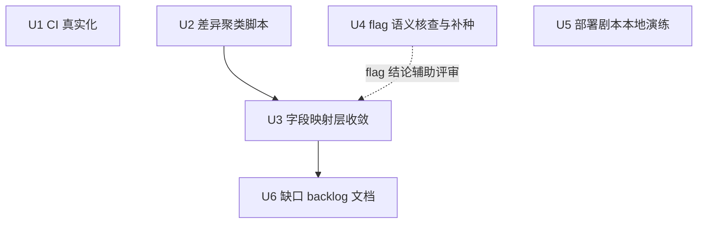

# Parity 收敛第二阶段——CI 真实化与字段映射层

## Summary

把行为对比从"本地一次性战役"升级为"可持续收敛体系"：让 CI 每次 PR 都产出真实 Rust vs Java 对比数字并留存报告产物；对剩余 836 FAIL 中最大的可转换层（字段形状差异）建立"聚类→评审→入库→重测"的机械化通道；同时核查 Java 各 war 的旗标解析语义以补全种子、在本地完整演练部署剧本为 R1 生产切流扫障，并把深层逻辑缺口固化为带证据的排序 backlog。

---

## Problem Frame

上一阶段（R1–R10 收官 + 行为对比首次实跑）建立了真实基线 **1212 PASS / 836 FAIL / 1996 SKIP**，并将剩余失败归因到三层：业务数据不对称（已建种子基建但首轮持平）、**字段形状层**（本轮主攻）、深层业务逻辑缺口（backlog）。三个结构性问题仍未解决：(1) CI 的 behavior-compare job 因历史缺陷从未产出真实对比，基线无守护；(2) 字段差异散落在报告中，无系统性聚类与入库通道；(3) Java 侧旗标解析语义未核实，种子命中率存在盲区。详见 `docs/audits/final-coverage-sweep.md` §六（含种子轮三层归因）。

---

## Requirements

- R1. CI 的 behavior-compare job 在每次 PR 上执行 Rust 侧种子并产出真实对比结果，`behavior-report.md` 作为产物留存，FAIL 数变化可在 PR 上直接观察。
- R2. 字段形状层具备"自动聚类候选 → 人工/代理评审 → allowlist 或 handler 修正 → 全量重测"的闭环，且每条入库的改名对都携带证据（端点 + 双侧响应摘录），禁止无证据批量白名单。
- R3. Java 各 war 的旗标（flag）解析链以源码为准形成书面矩阵；种子资产据此修正补全（至少覆盖 category/forum 两个此前未命中的域），Java 侧不可行项明确留档原因。
- R4. 部署剧本（shadow-traffic / toggle_module / rollback）在本地双栈完成一次端到端演练，产出演练记录；发现的脚本缺陷按最小修复原则处理或留档。
- R5. 深层逻辑缺口从对比报告中固化为独立排序 backlog 文档，每条含端点、证据摘录、疑似缺失能力、建议归属 crate。

**Origin actors:** 延续需求文档口径——技术负责人（签核 allowlist 扩充与 backlog 优先级）、运维（接收 U5 演练记录用于 R1 排期）；角色编号见原文档 Actors 节。（see origin: docs/brainstorms/2026-08-25-oa4rust-o2server-residual-gaps-requirements.md）

## Scope Boundaries

- 不实现工作流引擎（processplatform service/processing）深层业务逻辑——仅进 backlog。
- 不以 FAIL=0 为目标；成功标准是"剩余集合有界、逐条归因、可重放对照"。
- 不手工编辑 `oa4rust/tests/behavior_comparison/endpoints.rs`（生成器产物，路径照旧）。
- 不放宽比较器方法论（404-SKIP、空集等价等规则冻结），除非新证据支持单项修订。
- 不执行真实生产切流（U6/R1 属运维排期，本计划只做本地演练预备）。

### Deferred to Follow-Up Work

- 若字段聚类揭示需要 schema 级投影重构（而非 handler 层修正）：拆独立 refactor 计划。
- Java 侧种子进 CI（需容器内 REST 编排）：待 U4 把配方稳定后再评估。

---

## Context & Research

### Relevant Code and Patterns

- `oa4rust/.github/workflows/ci.yml` behavior-compare job（postgres 服务容器 + o2server 容器冷启 ~10min + 就绪探针 + `cargo test --test behavior_compare`）：本轮改造点；注意该 job 的 `DATABASE_URL` 库名与单测 job 不同，执行期核对服务容器的 `POSTGRES_DB` 与之一致。
- `oa4rust/tests/behavior_comparison/seeds/seed_fixtures.sql`（19 条幂等 INSERT，组织域 + 内容域）与 `seed_fixtures_java.http.md`（xadmin 登录 + REST 配方）——U1 直接复用，U4 修订对象。
- `oa4rust/tests/behavior_comparison/comparator.rs`：45s 超时、java_war 空 SKIP、路由级 404 SKIP、空数组≈缺字段等价——方法论已冻结，本计划不改其规则。
- `oa4rust/tests/behavior_comparison/allowlist.yaml`：字段改名对制（rust_field/java_field/reason），现有约 26+65 行——U3 的扩展点。
- `oa4rust/scripts/` 既有生成器纳管模式（`.gitignore` 白名单例外 + 注释说明）——U2 新脚本沿用。
- 失败证据源：`oa4rust/target/debug/behavior-report.md`（按 crate 分节，diff 串形如 `data.X: missing in Java prompt: missing in Rust`）——U2 的解析输入。

### Institutional Learnings

- `docs/solutions/best-practices/oa4rust-o2server-parity-closure-campaign-2026-08-25.md`：信封 Gson 对齐、包装模式战役的方法论与教训。
- `docs/solutions/security-issues/idor-vulnerability-write-handlers.md`：handler 改动时的所有权门禁要求（U3 触碰 handler 时适用）。
- `docs/solutions/architecture-patterns/actionresult-9-field-contract.md`：任何响应形状修正的契约基准。
- 终扫 §六 种子轮归因：appinfo 按 name 命中 ✓、unit 报"不存在"、分类/论坛/会议 REST 创建路径未命中——U4 的起点清单。

---

## Key Technical Decisions

- **种子在 CI 以步骤执行（仅 Rust 侧）**：org/content 种子是跨库数据前提，无法由测试进程安全自建；Java 容器侧 REST 种子编排成本高且不稳定，不进 CI——因此 CI 的 FAIL 基线天然高于本地双栈全播种环境，此偏差在 job 输出中显式标注，避免误读。
- **聚类脚本只产候选、不动 allowlist**：种子轮教训（盲目对齐会粉饰真实差异）制度化——脚本输出 TSV/Markdown 候选与证据摘录，入库前必须经评审（人或代理）逐条确认；脚本自身保持只读分析工具定位。
- **flag 语义以 o2server 源码为准**：黑盒 curl 只做验证，解析链结论必须落到对应 Action 类源码（如按 id→unique→name 的实际顺序），杜绝猜测性补种。
- **演练发现即处置**：U5 发现的脚本缺陷若为 ≤10 行级修复则当场修，否则记入演练记录交运维，不在本计划内展开。
- **backlog 单文件制**：集中 `docs/audits/behavior-divergence-backlog.md`，按出现频率排序，避免散落多个文档难以排期。

---

## Open Questions

### Resolved During Planning

- 聚类脚本的输出物形态：TSV（机读）+ Markdown（人审）双产物，落 `target/` 不入仓库，仓库只收脚本本身。
- CI 种子失败的失败策略：psql 应用失败应使 job 快速失败（fail-fast），防止在错误数据前提下产出误导性报告。

### Deferred to Implementation

- ci.yml 服务容器 `POSTGRES_DB` 与 behavior job `DATABASE_URL` 库名的最终对齐方式（改 env 还是建库步骤）——执行期读完整 service 块后定。
- U3 首轮可转化量的精确数字——依赖 U2 聚类输出，计划只承诺流程不承诺数字。
- U5 演练中 nginx mirror 配置在本地是否可简化绕过——取决于脚本对 nginx 的实际依赖程度，执行期判定。

---

## Implementation Units

### U1. CI behavior-compare 真实化：种子接入 + 报告产物

**Goal:** PR 级持续产出真实 parity 数字，基线有守护、退化可见。

**Requirements:** R1

**Dependencies:** 无

**Files:**
- Modify: `oa4rust/.github/workflows/ci.yml`

**Approach:**
- 在就绪探针通过之后、`cargo test --test behavior_compare` 之前插入种子步骤：以 psql 对 behavior job 的数据库执行 `tests/behavior_comparison/seeds/seed_fixtures.sql`，失败即终止该 job。
- 测试步骤后追加报告产物上传（`actions/upload-artifact@v4`，`if: always()`，路径 `target/debug/behavior-report.md`），命名含 run id 便于追溯。
- 在测试步骤的输出中打印一行基线注记：CI 未执行 Java 侧 REST 种子，FAIL 基线预计高于本地双栈值，属预期。

**Patterns to follow:** 该文件既有 job 的 step 组织与 env 注入风格；`actions/upload-artifact@v4` 已在其他 workflow 步骤中出现过的写法。

**Test scenarios:**
- Happy path: 本地以 docker 复刻 job 关键步骤顺序（起 postgres 容器→应用种子→断言行数>0）→ 种子全部生效。
- Error path: 故意提供错误库名的 DATABASE_URL 执行种子步骤 → psql 非零退出、job 终止（验证 fail-fast 生效）。
- Edge case: 种子重复应用（幂等重放）→ 无报错、行数不变。
- Integration: YAML 语法经解析器加载通过，且新步骤位于既定位置（就绪探针之后、测试之前）。

**Verification:** 本地复刻步骤全绿；ci.yml 解析无误；PR 模拟运行（或 push 到试验分支触发）能上传 report 产物。

---

### U2. 差异聚类脚本 cluster_behavior_diffs.py

**Goal:** 把报告中数百条字段级 FAIL 自动聚类为"候选改名对 + 证据摘录"，使人审成本从逐条降为逐簇。

**Requirements:** R2

**Dependencies:** 无

**Files:**
- Create: `oa4rust/scripts/cluster_behavior_diffs.py`
- Modify: `.gitignore`（scripts 白名单例外区追加一条，附注释）

**Approach:**
- 输入：behavior-report.md；解析 FAIL 行的 method/endpoint/crate/diff 串。
- 聚类规则：同一端点行内成对出现的 `A: missing in Java` + `B: missing in Rust` 记为候选改名对 (A,B)；跨端点聚合频次；`type differs` 单列归类不进改名对。
- 输出（写 `target/`）：`diff_candidates.tsv`（pair、频次、示例端点列表）+ `diff_candidates.md`（按频次排序、每对附最多 3 条端点证据摘录）。
- 只读分析工具：不修改 allowlist/report，不联网。

**Execution note:** 先写一个最小解析器的特征测试（构造样例报告片段→断言聚类输出），再实现全量解析。

**Patterns to follow:** `oa4rust/scripts/regen_endpoints.py` 的路径基准、编码处理与 main 流程风格。

**Test scenarios:**
- Happy path: 用含 3 类典型 diff（missing 配对 / 单侧 missing / type differs）的样例报告 → TSV 行数与配对正确、type differs 不产生 pair。
- Edge case: 空报告 / 无 FAIL 行 → 输出空产物且退出码 0。
- Edge case: 同一字段名在多 crate 出现 → 频次聚合而非去重丢失。
- Error path: 报告文件不存在 → 明确报错退出非零。

**Verification:** 对当前真实 behavior-report.md 跑通，产出的候选文件可被 U3 直接消费。

---

### U3. 字段映射层收敛：候选评审入库 + 投影修正 + 重测

**Goal:** 将字段形状层中"确属同义异名"的部分经 allowlist 收敛，"确属 Rust 投影错误"的部分修正 handler，产出新一轮全量对比数字。

**Requirements:** R2

**Dependencies:** U2（候选来源）、U4（flag 结论可修正部分误判）

**Files:**
- Modify: `oa4rust/tests/behavior_comparison/allowlist.yaml`
- Modify: 按 U2 聚类结果确定的若干 crate handler（预期集中在投影 SQL 的 SELECT 列表别名层面；上限先取可转化对数最高的 5 个 crate）
- Test: 受影响 crate 既有单元测试随改随跑；行为级验证走全量 compare 重跑

**Approach:**
- 评审门：逐候选对核对 U2 附带的端点证据（必要时现场 curl 双侧取证），三态裁决——采纳改名对 / 判定 Rust 投影错误转 handler 修正 / 驳回（记录理由）。
- handler 修正遵循 ActionResult 9 字段契约与 IDOR 门禁要求，仅动 SELECT 别名/组装层，不改业务语义。
- 收敛后重跑全量 compare，记录 PASS/FAIL/SKIP 前后对照表入终扫 §六 追加小节。

**Execution note:** 每采纳一批（建议 ≤20 条）即重测一次，小步验证避免一次性入库导致回归不可定位。

**Patterns to follow:** allowlist.yaml 既有条目的 reason 写法；包装模式战役（提交 9d81b8ca）的"实测形状对齐"判据。

**Test scenarios:**
- Happy path: 某采纳对在重测后对应端点由 FAIL 转 PASS。
- Edge case: 同名对在 A 端点是同义、在 B 端点非同义（证据冲突）→ 不入库，记录冲突留档。
- Error path: 误入库导致先前 PASS 端点转 FAIL → 重测捕获后回退该条并在 reason 标注废弃原因。
- Integration: 触碰 handler 后对应 crate 单元测试套件 0 failed。

**Verification:** 全量 compare 数字相对 1212/836 基线的增量被记录；allowlist 新增条目 100% 带 reason 与证据引用；受影响 crate 测试全绿。

---

### U4. Java flag 语义核查与种子补全

**Goal:** 以源码确立各 war 的 flag 解析链，修正种子使两侧对字面 URL 尽可能同命中，消除种子轮的盲区。

**Requirements:** R3

**Dependencies:** 无（结论反哺 U3 评审）

**Files:**
- Modify: `oa4rust/tests/behavior_comparison/seeds/seed_fixtures.sql`
- Modify: `oa4rust/tests/behavior_comparison/seeds/seed_fixtures_java.http.md`

**Approach:**
- 建 probe 矩阵：对每个已播种字面标识符 × 相关 war 的 GET 端点，curl 取证（hit/error + 错误类型）。
- 对 error 项读 o2server 对应 Action 类源码（`oa/o2server/x_*_assemble_*/src/main/java/.../jaxrs/*/Action*.java` 的 get/list-by-flag 实现），书面确定解析链（查什么列、什么顺序），写入 http.md 新增「FLAG_SEMANTICS」附录。
- 按链修正种子（调整 name/unique 值或 REST payload），补齐 category/forum 的创建路径；meeting 等 flag 仅认 id 且 REST 无法指定 id 的实体，明确记为"Java 侧不可种"及原因。
- Rust 侧同步核对影子表查询的字面匹配假设（S1 曾静态核对 control 域，express 域抽查即可）。

**Test scenarios:**
- Happy path: 修正后的 category/forum 字面 URL 在 Java 侧返回 success 信封。
- Edge case: 某 war 的 flag 链只认 UUID 主键 → 该实体标"不可种"，矩阵中留痕。
- Integration: 修正种子重放后，抽样 5 个此前 error 的组织/CMS 端点双侧状态趋同。

**Verification:** FLAG_SEMANTICS 附录覆盖所有已探测 war；种子文件更新后幂等重放通过；probe 矩阵 hit 率提升有数字记录。

---

### U5. 部署剧本本地双栈演练

**Goal:** 在本地 Docker 双栈上端到端执行灰度剧本，验证其可操作性，为 R1 生产切流扫清脚本障碍。

**Requirements:** R4

**Dependencies:** 无

**Files:**
- Modify: `oa4rust/deploy/shadow-traffic.sh`、`oa4rust/deploy/toggle_module.sh`（仅当演练暴露 ≤10 行级缺陷时）
- Modify: `oa4rust/deploy/rollback-playbook.md`（追加演练记录小节）

**Approach:**
- 经 bash 容器执行（本机无 bash，docker bash 路径已验证可用）：status → gray 10% → status 断言生效 → rollback → status 断言还原；shadow-traffic.sh run 对本地 3000/18080 发一轮影子请求。
- 记录每步实际输出与偏差；nginx 依赖若构成阻塞，评估最小绕过（如直连后端模式）并留档，不强改生产拓扑。
- 演练记录固化进 rollback-playbook.md：命令序列、观察点、已知限制、运维交接注意事项。

**Test scenarios:**
- Happy path: gray→status 显示比例生效；rollback→status 还原默认。
- Error path: 对未知模块名执行 gray → 非零退出并列出可用模块（既有行为，回归确认）。
- Integration: shadow run 的请求确实到达本地 Rust 服务（服务日志可见访问）。

**Verification:** 演练记录小节存在于 playbook；全程无非预期中断；发现的缺陷要么已修要么逐条留档。

---

### U6. 深层逻辑缺口排序 backlog

**Goal:** 把"真缺口"从报告转化为可排期的开发任务清单，终结其在对比报告中的模糊状态。

**Requirements:** R5

**Dependencies:** U3（一轮重测后的最新报告为数据源）

**Files:**
- Create: `docs/audits/behavior-divergence-backlog.md`

**Approach:**
- 筛选口径：Rust 错误而 Java 成功（`prompt: missing in Java + data: missing in Rust` 方向）且 U3 评审未归入改名/投影修正的端点，加上其他结构性差异残留。
- 每条记录：endpoint、method、证据摘录（双侧响应要点）、疑似缺失能力（参照 Java 对应 Action 名）、建议归属 crate、出现频次。
- 按频次降序排列；文首注明生成日期与报告版本，便于后续再生成比对。

**Test scenarios:**
- Test expectation: none -- 纯文档产物，无行为变更；质量以"每条含证据且可追溯到报告"验收。

**Verification:** backlog 覆盖筛选口径下全部端点（计数对账）；抽 3 条人工核对其证据摘录与报告一致。

---

## System-Wide Impact

- **Interaction graph:** U3 触碰 handler 投影会影响 openapi/mcp 生成器消费的路由描述面的间接一致性——投影改动不注册/注销路由，理论无影响，重跑 `regen_endpoints.py` 校验零漂移作为保险。
- **Error propagation:** CI 种子失败采用 fail-fast，错误数据前提不会流入对比报告。
- **State lifecycle risks:** 种子幂等（ON CONFLICT/NOT EXISTS），重放安全；U5 灰度演练操作 `.module_routing.env` 与 nginx 配置，rollback 步骤必须最后执行以防本地栈残留状态。
- **API surface parity:** allowlist 扩充改变"结构等价"判定口径——每条带证据是为可审计性，防止口径漂移掩盖真实回归。
- **Unchanged invariants:** 比较器方法论规则、endpoints.rs 生成路径、ActionResult 9 字段契约均不变；本计划全部工作在其上叠加。

---

## Risks & Dependencies

| Risk | Mitigation |
|------|------------|
| 子代理/上游服务不稳定（本会话已多次发生） | 执行期允许任一单元降级为主会话直做，计划不依赖并行代理架构 |
| allowlist 误扩粉饰真实差异 | 三态评审门 + 每条证据 + 小批重测 + 误入库回退流程（U3 场景覆盖） |
| o2server 冷启 ~10min 拖慢 CI | 既有 job 已并行编译预热；本轮不新增串行等待 |
| Java flag 根因深藏框架内部超出时间盒 | probe 矩阵逐 war 留痕，未决项显式标 UNKNOWN 而非猜结论 |
| U5 演练污染本地双栈状态 | 严格 rollback 收尾；bc-postgres 可整体重建（迁移+种子重放） |

---

## Documentation / Operational Notes

- U3/U6 完成后在 `docs/audits/final-coverage-sweep.md` §六追加收敛数字与小节（延续既有惯例）。
- U5 演练记录即运维交接物，R1 排期会议可直接引用。
- 若 U1 使 CI 首次产出真实数字，预期首跑 FAIL 高于本地值（无 Java 种子），需在 PR 描述中预防性说明。

---

## Sources & References

- 证据基座：`docs/audits/final-coverage-sweep.md` §六（实跑终态 1212/836/1996 + 种子轮三层归因）
- 方法论沉淀：`docs/solutions/best-practices/oa4rust-o2server-parity-closure-campaign-2026-08-25.md`
- 种子资产：`oa4rust/tests/behavior_comparison/seeds/`（提交 37307ac9）
- 实跑框架：提交 611e0e1a / 9d81b8ca / b201144f 及其对话记录
- 上游需求（已收官的背景）：`docs/brainstorms/2026-08-25-oa4rust-o2server-residual-gaps-requirements.md`
